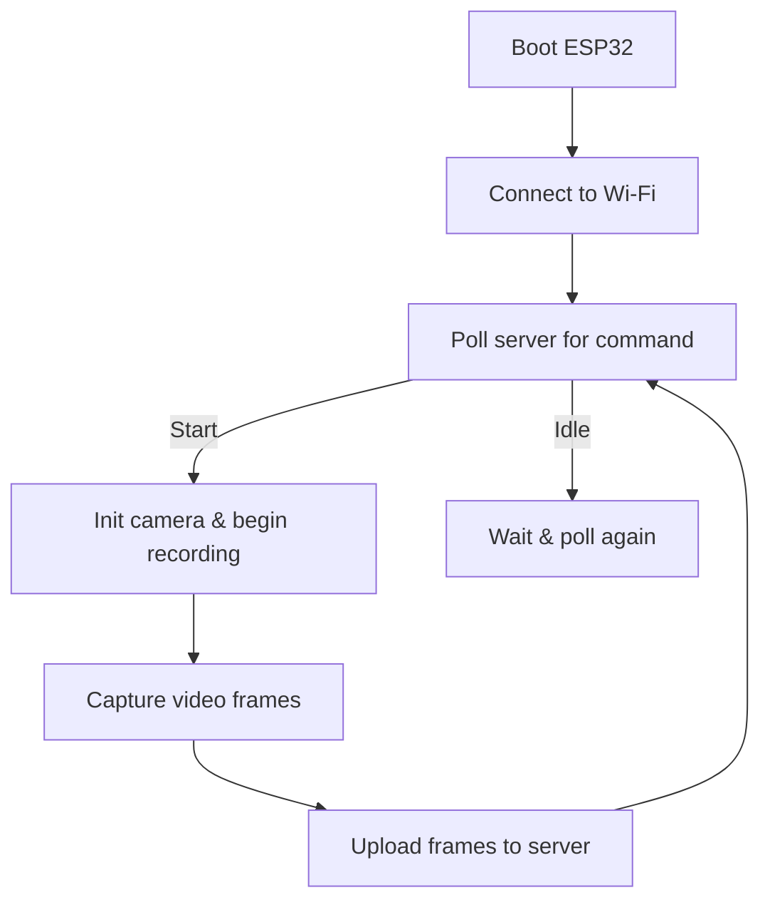
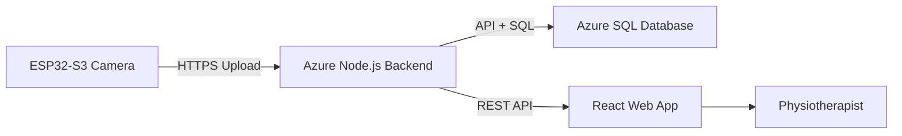

# 📸 ESP32-S3 Camera Streaming & Upload Project

## 📌 Overview
This project implements **real-time video capture and upload** using a  
**Seeed Studio XIAO ESP32-S3 Sense Camera**.  

The ESP32:
- Connects to Wi-Fi.  
- Captures video frames via the onboard camera.  
- Streams or uploads them to a backend server (e.g., Azure) using HTTPS.  

✅ Supports **MJPEG/AVI** streaming and fallback to **JPEG snapshots**.  
✅ Designed for **physiotherapy walking lab project** (patient monitoring).  

---

## ⚙️ Hardware Requirements
- **Seeed Studio XIAO ESP32-S3 Sense** (camera module).  
- USB-C cable for programming and power.  
- Wi-Fi network (home router or smartphone hotspot).  
- *(Optional)* SD card module for offline storage.  

---

## 🛠️ Software Requirements
- **Arduino IDE** (≥ 2.0) or **PlatformIO**.  
- ESP32 board support (`esp32` by Espressif).  
- Required Arduino libraries:
  - `WiFi.h`
  - `esp_wifi.h`
  - `WiFiClientSecure.h`
  - `HTTPClient.h`
  - `ArduinoJson.h`
  - `esp_camera.h`

---

## 📂 Project Structure
```
project/
│── sketch_aug30a.ino      # Main Arduino sketch
│── camera_pins.h          # Pin definitions for XIAO ESP32S3 Camera
```

---

## 🔧 Pin Configuration
From **camera_pins.h**:

| Pin  | GPIO | Function            |
|------|------|---------------------|
| Y2   | 15   | Data bit 0          |
| Y3   | 17   | Data bit 1          |
| Y4   | 18   | Data bit 2          |
| Y5   | 16   | Data bit 3          |
| Y6   | 14   | Data bit 4          |
| Y7   | 12   | Data bit 5          |
| Y8   | 11   | Data bit 6          |
| Y9   | 48   | Data bit 7          |
| XCLK | 10   | Camera clock        |
| VSYNC| 38   | Vertical sync       |
| HREF | 47   | Horizontal reference|
| PCLK | 13   | Pixel clock         |
| SIOC | 39   | I²C SCL             |
| SIOD | 40   | I²C SDA             |

> PWDN & RESET are disabled (`-1`).  

---

## 🚀 Setup & Deployment
1. Clone this repository:
   ```bash
   git clone https://github.com/<username>/esp32-camera-project.git
   cd esp32-camera-project
   ```
2. Open `sketch_aug30a.ino` in Arduino IDE.  
3. Install ESP32 boards via Boards Manager.  
4. Select **Seeed XIAO ESP32-S3**.  
5. Update Wi-Fi credentials:
   ```cpp
   const char* ssid = "YourNetwork";
   const char* password = "YourPassword";
   ```
6. Update **server API endpoints** inside code.  
7. Upload sketch to ESP32.  
8. Open Serial Monitor @ **115200 baud**.  

---

## 🧩 Core Functions & Logic

### 🔹 Camera Initialization
```cpp
#include "camera_pins.h"
esp_camera_init(&config);
```

### 🔹 Wi-Fi Connection
```cpp
WiFi.begin(ssid, password);
```

### 🔹 Command Polling
```cpp
HTTPClient http;
http.begin(COMMAND_URL);
```

### 🔹 Video Capture
```cpp
camera_fb_t* fb = esp_camera_fb_get();
```

### 🔹 Upload
```cpp
http.POST(fb->buf, fb->len);
```

---

## 🔄 Typical Workflow



---

## 📝 Example Code (`setup()` & `loop()`)
```cpp
void setup() {
  Serial.begin(115200);

  // Connect Wi-Fi
  WiFi.begin(ssid, password);
  while (WiFi.status() != WL_CONNECTED) {
    delay(500);
    Serial.print(".");
  }
  Serial.println("\n✅ WiFi connected!");

  // Init camera
  camera_config_t config = { ... }; // from camera_pins.h
  if (esp_camera_init(&config) != ESP_OK) {
    Serial.println("❌ Camera init failed!");
    return;
  }
  Serial.println("✅ Camera ready");
}

void loop() {
  // Poll server for command
  String cmd = getServerCommand();
  if (cmd == "start") {
    camera_fb_t* fb = esp_camera_fb_get();
    if (fb) {
      uploadFrame(fb);   // send to server
      esp_camera_fb_return(fb);
    }
  }
  delay(1000);
}
```

---

## 📊 Example Serial Log
```
Connecting to WiFi...
WiFi connected: 192.168.1.45
Polling server for command...
Command: start (patient=1)
▶️ Recording started
Uploading video chunk...
Uploading video chunk...
⏹ Recording stopped
```

---

## 🖥️ System Architecture


---

## 🛠️ Troubleshooting
- **Wi-Fi not connecting** → Double-check SSID/password, try 2.4GHz only.  
- **Camera init failed** → Verify correct board selection, check pins.  
- **Upload stuck** → Ensure server endpoint is HTTPS and valid certificate.  
- **Video not playable** → Convert `.avi` → `.mp4` using FFmpeg with `-movflags +faststart`.  

---

## 📌 Future Improvements
- Add **SD card fallback** when offline.  
- Adaptive bitrate for smoother streaming.  
- End-to-end encryption for medical compliance.  
- More robust retries and logging.  

---

## 🤝 Contributing
Pull requests are welcome!  
For major changes, open an issue first to discuss.  

---

## 📄 License
This project is licensed under the **MIT License**.  

---

## 👤 Author
Developed by **Noa Gilboa** (2025)  
Part of the **Mobile Walking Lab Project**.  
🔗 Server-side: [MobileWalkingLab_server](https://github.com/NoaGilboa/MobileWalkingLab_server)

---
